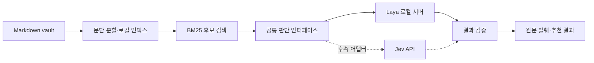

<h1 align="center">Brain OpenKit</h1>

<p align="center">
  <strong>Obsidian을 위한 오픈소스 세컨드 브레인 도구 모음.</strong><br>
  판단 모델을 교체할 수 있는 Obsidian 로컬 검색·정리 도구.
</p>

<p align="center">
  <a href="LICENSE"></a>
  
  <a href="https://huggingface.co/convaiinnovations/laya-multilingual"></a>
</p>

<p align="center">
  <a href="README.md">English</a> · 한국어<br>
  <a href="#목표-기능">소개</a> ·
  <a href="#예정된-작업-흐름">작업 흐름</a> ·
  <a href="#로드맵">로드맵</a> ·
  <a href="CONTRIBUTING.md">기여하기</a>
</p>

> **현재는 설계 단계입니다.** 이 저장소에는 설계서와 프로젝트 안내 문서가 있습니다.
> CLI, 검색 엔진, 모델 어댑터는 구현 예정이며, 실행 가능한 Brain OpenKit 앱이나 설치 패키지는
> 아직 없습니다. 아래 명령은 만들려는 인터페이스의 예시입니다.

Brain OpenKit은 Obsidian vault에 쌓인 지식을 찾고 정리하기 위한 오픈소스 프로젝트입니다.
로컬 검색으로 후보 문단을 찾고, 판단 모델로 관련성을 평가하며, 분류와 태그를 추천하는
구조를 설계하고 있습니다. 결과에는 원본 Markdown의 경로와 위치를 함께 표시합니다.

첫 구현은 로컬 서버로 실행하는 [Laya](https://github.com/NandhaKishorM/laya)를 사용합니다.
이후 [TypeSafe Jev](https://docs.typesafe.ai/introduction/quickstart)도 연결할 수 있도록
공통 제공자 인터페이스를 둡니다.

## 목표 기능

- **원문을 확인할 수 있는 검색:** 검색 결과에 노트 경로, 줄 번호, 실제 발췌를 표시합니다.
- **정리 추천:** 사용자가 정한 분류에서 적절한 항목을 선택하고, 태그별 적용 여부를 판단합니다.
  한 노트에 여러 태그를 추천할 수 있습니다.
- **로컬 판단 모델:** Laya 다국어 모델부터 시작해 한국어·영어 노트에서 품질을 평가합니다.
- **교체 가능한 모델:** 인덱싱, 파일 처리, 작업 흐름을 제공자의 주소·인증·모델 설정과 분리합니다.

초기 CLI의 범위는 지정한 vault를 읽고 추천 결과를 출력하는 것입니다.
추천 반영, 위키 생성, Obsidian 화면 연동은 후속 단계로 계획합니다.

## 예정된 작업 흐름



검색은 BM25로 후보를 좁힌 뒤 Laya가 질문과 후보 문단의 관련성을 각각 판단하는 방식입니다.
현재 설계의 기본값은 후보 문단 20개와 결과 노트 5개입니다.
분류·태그 추천에는 사용자가 정한 분류 목록과 태그 설명을 사용합니다.

Laya와 Jev의 역할은 구조화된 판단입니다. 자유 형식의 요약이나 여러 문서를 종합하는 기능은
해당 단계에서 별도의 생성형 모델을 연결해 구현할 예정입니다.

## 지금 살펴볼 내용

현재는 [설계서](docs/superpowers/specs/2026-10-04-obsidian-laya-design.md),
[로드맵](#로드맵), [기여 안내](CONTRIBUTING.md)를 확인할 수 있습니다.
설치 방법과 검증된 실행 안내는 첫 CLI 릴리스에 함께 제공할 예정입니다.

상위 프로젝트의 모델을 별도로 살펴보려면 [Laya 저장소](https://github.com/NandhaKishorM/laya)와
[다국어 모델 카드](https://huggingface.co/convaiinnovations/laya-multilingual)를 참고하세요.
Laya 자체를 실행하는 것과 Brain OpenKit을 설치하는 것은 별개의 과정입니다.

## 예정된 CLI

**인터페이스 미리보기입니다. 현재 저장소에서 실행할 수 있는 명령은 아닙니다.**

```text
brain-openkit doctor
brain-openkit index --vault /path/to/vault
brain-openkit search "로컬 검색을 어떻게 평가했지?" --vault /path/to/vault
brain-openkit classify /path/to/vault/note.md --taxonomy taxonomy.json
brain-openkit evaluate evaluation.jsonl --vault /path/to/vault
```

결과는 터미널 출력과 JSON으로 제공할 계획입니다. 모델 서버에 연결할 수 없을 때를 포함해,
BM25로 찾은 결과와 모델 재정렬까지 수행한 결과를 구분해서 표시합니다.

## 모델 제공자

아래 두 연동은 모두 구현 예정입니다.

| 제공자 | 역할 | 연결 방식 | 인증 |
| --- | --- | --- | --- |
| Laya | 첫 구현에서 사용할 로컬 판단 모델 | 로컬 HTTP 서버, 기본 `127.0.0.1:8000` | 서버 인증 설정 시 `LAYA_API_KEY` |
| Jev | 후속 제공자 옵션 | TypeSafe API | 사용자 키 `TYPESAFE_API_KEY` |

초기 Laya 모델은
[`convaiinnovations/laya-multilingual`](https://huggingface.co/convaiinnovations/laya-multilingual)로
계획합니다. 기본 `laya` 체크포인트는 영어용이므로 한국어와 여러 언어가 섞인 vault에는
다국어 체크포인트부터 평가합니다.

어댑터는 입력 한도를 검증하고 제공자별 신뢰도 정보를 보존합니다.
응답 형식이 같아도 같은 신뢰도 임계값을 그대로 적용하지 않습니다.
자세한 내용은 [설계서의 제공자 계약](docs/superpowers/specs/2026-10-04-obsidian-laya-design.md)을
참고하세요.

## 데이터 처리와 평가

기본 설계에서는 로컬 서버에 연결했을 때 인덱싱과 Laya 추론이 사용자 컴퓨터에서 실행됩니다.
최초 의존성·모델 다운로드에는 네트워크가 필요합니다. 원격 서버나 후속 Jev 어댑터를 선택하면
추론에 사용하도록 선택한 입력이 해당 서버로 전송됩니다.

아직 Brain OpenKit의 검색·분류 품질, 지연 시간, 비용 측정 결과는 없습니다.
첫 평가에서는 BM25 단독 검색과 Laya 재정렬을 비교하고, 한국어·영어 성능, 최초·반복 실행 시간,
정확한 모델 버전을 기록할 계획입니다. 로컬 추론에는 외부 모델의 요청당 요금 대신
장비·메모리·전력 비용이 듭니다.

## 로드맵

- [x] CLI 범위와 교체 가능한 제공자 구조 설계
- [ ] 원문 위치를 보존하는 Markdown 인덱싱과 BM25 검색
- [ ] Laya를 연결한 검색 재정렬 및 분류·태그 추천
- [ ] 재현 가능한 평가와 첫 실행 가능한 CLI 릴리스
- [ ] Jev 어댑터와 제공자별 설정
- [ ] 검토한 메타데이터·링크 변경 반영과 복구
- [ ] 자료 수집, 위키 생성, 선택적인 생성형 모델 연결
- [ ] Obsidian 플러그인 또는 로컬 웹 화면 검토

## 기여하기

구체적인 검색 사례, 작은 한국어·영어 합성 노트 모음, 제공자 계약 검토, 문서 개선으로
첫 릴리스를 만드는 데 참여할 수 있습니다. [CONTRIBUTING.md](CONTRIBUTING.md)를 참고하세요.
기여 자료에는 개인 vault의 비공개 내용이나 API 키를 포함하지 마세요.

## 라이선스와 출처

Brain OpenKit의 자체 작성 자료에는 [MIT 라이선스](LICENSE)를 적용합니다.
외부 코드와 모델 가중치는 각자의 라이선스를 따릅니다.

이 프로젝트는
[`AgriciDaniel/claude-obsidian`](https://github.com/AgriciDaniel/claude-obsidian)의
원문과 연결된 지식 관리 방식에서 아이디어를 얻었습니다. Brain OpenKit은 독립 프로젝트이며
Obsidian, Laya, TypeSafe, claude-obsidian의 공식 연동 제품이 아닙니다.
참고 자료와 라이선스 구분은 [ATTRIBUTION.md](ATTRIBUTION.md)에 정리했습니다.
