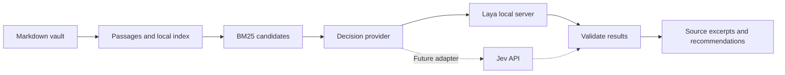

<h1 align="center">Brain OpenKit</h1>

<p align="center">
  <strong>An open-source second-brain toolkit for Obsidian.</strong><br>
  Local search and organization for Obsidian, with interchangeable decision models.
</p>

<p align="center">
  <a href="LICENSE"></a>
  
  <a href="https://huggingface.co/convaiinnovations/laya-multilingual"></a>
</p>

<p align="center">
  English · <a href="README.ko.md">한국어</a><br>
  <a href="#what-were-building">Overview</a> ·
  <a href="#planned-workflow">Workflow</a> ·
  <a href="#roadmap">Roadmap</a> ·
  <a href="CONTRIBUTING.md">Contribute</a>
</p>

> **Design stage.** This repository currently contains the design and community
> documentation. The CLI, search engine, and model adapters are planned; there
> is no runnable Brain OpenKit application or installable package yet. Command
> examples below describe the intended interface.

Brain OpenKit is an open-source project for finding and organizing knowledge in
Obsidian vaults. Its design combines ordinary local search with focused model
decisions: retrieve candidate passages, judge their relevance, and suggest
categories or tags while keeping the original Markdown and source locations
visible.

The first implementation will use [Laya](https://github.com/NandhaKishorM/laya)
through a local server. A common provider interface will make room for
[TypeSafe Jev](https://docs.typesafe.ai/introduction/quickstart) later.

## What we're building

- **Search with context.** Retrieve passages and return the note path, line
  numbers, and original excerpt so you can check a result yourself.
- **Suggest organization.** Choose from your existing categories and evaluate
  tags independently, allowing multiple tags per note.
- **Use a local decision model.** Start with Laya's multilingual checkpoint for
  Korean and English notes; measure quality on actual note-retrieval tasks.
- **Keep the model replaceable.** Keep indexing, file handling, and workflows
  independent of a provider's endpoint, authentication, and model settings.

The initial CLI will read your selected vault and produce recommendations.
Applying changes, generating wiki pages, and an Obsidian UI are later milestones.

## Planned workflow



For search, BM25 will find a shortlist before Laya evaluates each query/passage
pair. The proposed defaults are 20 candidate passages and five result notes.
For organization, a user-defined taxonomy will supply category and tag choices.

Laya and Jev provide structured decisions. Free-form summaries and synthesis
will require a separate generation component if that milestone is implemented.

## Start here

The useful entry points today are the
[design specification (Korean)](docs/superpowers/specs/2026-10-04-obsidian-laya-design.md),
the [roadmap](#roadmap), and the [contribution guide](CONTRIBUTING.md).
Installation instructions and a tested quick start will accompany the first
runnable release.

To explore the upstream model independently, see the
[Laya repository](https://github.com/NandhaKishorM/laya) and
[multilingual model card](https://huggingface.co/convaiinnovations/laya-multilingual).
Running Laya by itself does not install Brain OpenKit.

## Planned CLI

**Interface preview — these commands are not executable in this repository yet.**

```text
brain-openkit doctor
brain-openkit index --vault /path/to/vault
brain-openkit search "How did I evaluate local search?" --vault /path/to/vault
brain-openkit classify /path/to/vault/note.md --taxonomy taxonomy.json
brain-openkit evaluate evaluation.jsonl --vault /path/to/vault
```

Results are intended to support both readable terminal output and JSON. Search
results will distinguish ordinary BM25 retrieval from successful model
reranking, including when the model server is unavailable.

## Model providers

Both integrations below are planned.

| Provider | Role | Connection | Authentication |
| --- | --- | --- | --- |
| Laya | First implementation; local decisions | Local HTTP server, default `127.0.0.1:8000` | Optional server key via `LAYA_API_KEY` |
| Jev | Later provider option | TypeSafe API | User key via `TYPESAFE_API_KEY` |

The initial Laya model will be
[`convaiinnovations/laya-multilingual`](https://huggingface.co/convaiinnovations/laya-multilingual).
The base `laya` checkpoint is intended for English; the multilingual checkpoint
is the planned starting point for Korean and mixed-language vaults.

Provider adapters will validate input limits and preserve provider-specific
confidence information. A shared response shape does not make confidence
thresholds interchangeable. See the [provider contract in the design](docs/superpowers/specs/2026-10-04-obsidian-laya-design.md).

## Data and evaluation

The planned default keeps indexing and Laya inference on your machine when
connected to the local server. Initial dependency and model downloads require
network access. Choosing a remote server or the future Jev adapter sends the
selected inference input to that endpoint.

Brain OpenKit has no published retrieval, classification, latency, or cost results
yet. The first evaluation will compare BM25 alone with Laya reranking and report
Korean/English performance, warm and cold latency, and the exact model version.
Local inference avoids a hosted model's per-request charge, while still using
hardware, memory, and electricity.

## Roadmap

- [x] Document the CLI scope and interchangeable-provider design.
- [ ] Build Markdown indexing and BM25 retrieval with source locations.
- [ ] Connect Laya for reranking and category/tag recommendations.
- [ ] Publish a reproducible evaluation and the first runnable CLI release.
- [ ] Add the Jev adapter and provider-specific configuration.
- [ ] Add reviewed metadata/link updates with recovery.
- [ ] Extend to source ingestion, wiki creation, and optional generation.
- [ ] Explore an Obsidian plugin or local web interface.

## Contributing

Help shape the first release with concrete search examples, small synthetic
Korean/English note sets, provider-contract feedback, and documentation fixes.
Start with [CONTRIBUTING.md](CONTRIBUTING.md). Keep private vault content and API
keys out of contributions.

## License and acknowledgements

Brain OpenKit's original material is released under the [MIT License](LICENSE).
Third-party code and model weights retain their own licenses.

The project is inspired by
[`AgriciDaniel/claude-obsidian`](https://github.com/AgriciDaniel/claude-obsidian)'s
approach to source-linked knowledge workflows. Brain OpenKit is an independent
project; it is not an official Obsidian, Laya, TypeSafe, or claude-obsidian
integration. See [ATTRIBUTION.md](ATTRIBUTION.md) for references and license
boundaries.
