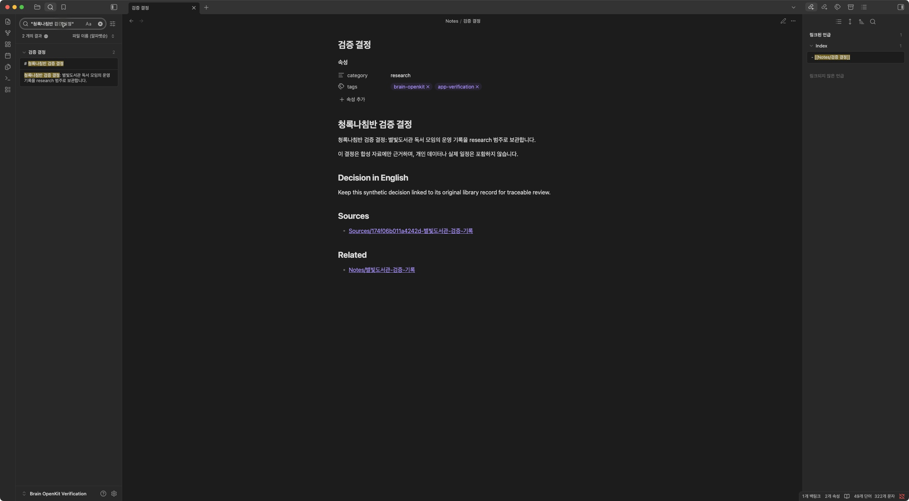
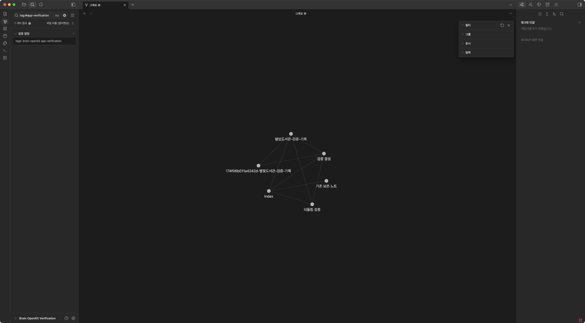
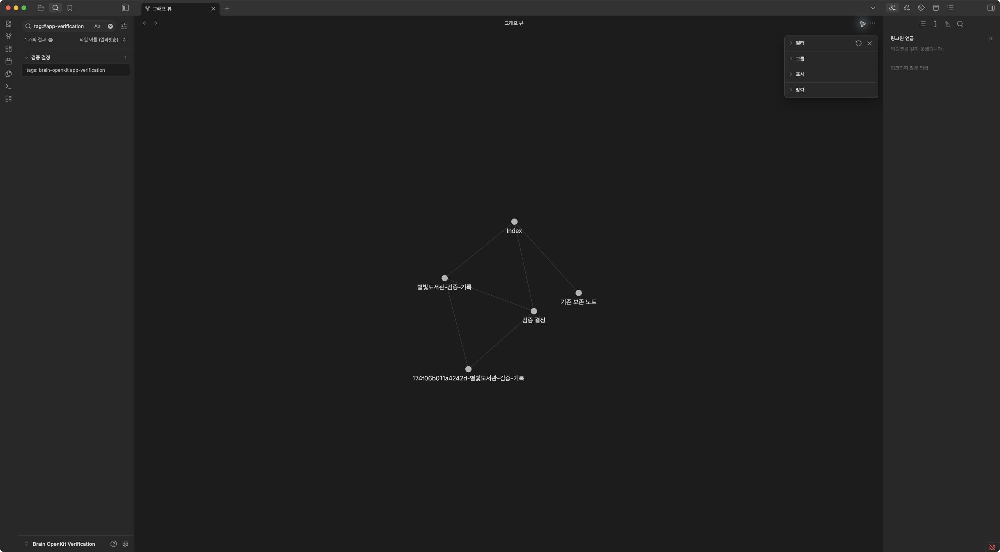

# Native Obsidian app verification — 2026-10-05

Brain OpenKit's generated Markdown worked in the actual Obsidian desktop app:
Korean/English content and properties rendered, native search found the notes,
links and backlinks navigated correctly, and the graph updated after a CLI
undo. The undo restored all five files from before the fold, with matching
SHA-256 hashes and byte counts. Final CLI lint reported five notes and no issues.

This run used Brain OpenKit `0.2.0a3` at
[`129143902919a6960cbd817f0582ee633bf55991`](https://github.com/hyeondata/brain-openkit/tree/129143902919a6960cbd817f0582ee633bf55991),
Obsidian **1.13.4**, **macOS 15.3.2** on arm64, and Python **3.13.1**.
All 16 recorded CLI commands completed successfully, and 11 native UI checks
passed. The run used a disposable vault named
`Brain OpenKit Verification`, containing only synthetic material.

## Method and evidence

The CLI initialized the vault, ingested a synthetic source, saved a supplied
decision draft, and added a category, tags, and an existing-note link through
inspected plans and exact plan IDs. It then created an extractive fold note.
Native UI automation opened that vault in Obsidian and exercised reading view,
search, properties, links, backlinks, and graph view. The CLI undid the fold
while the app remained open; native UI checks and an independent read-only
filesystem check verified the resulting state.

The [normalized report](../benchmarks/obsidian-app/2026-10-05/report.json),
[CLI command evidence](../benchmarks/obsidian-app/2026-10-05/cli-commands.json),
[native UI evidence](../benchmarks/obsidian-app/2026-10-05/native-ui-evidence.json),
and [post-undo verification](../benchmarks/obsidian-app/2026-10-05/post-undo-verification.json)
record the separate checks. Public screenshots show this synthetic vault.
Screenshots provide the primary visual evidence. Accessibility captures include
full trees for content search, saved-note rendering, and the final decision;
other entries can be incremental updates or unchanged-state messages. The
public JSON replaces local machine paths with placeholders; hashes and byte
counts refer to the original temporary-vault files before that normalization.

## Observed app behavior

| Check | Observed result |
| --- | --- |
| Saved note rendering | `Notes/검증 결정.md` displayed its Korean decision and English paragraph. Properties showed category `research` and tags `brain-openkit`, `app-verification`. |
| Native content search | The quoted query `"청록나침반 검증 결정"` showed four matches across two files before undo and two matches in one file afterward. These are text occurrences, not retrieval accuracy scores. |
| Native tag search | `tag:#app-verification` returned one result, the saved decision. |
| Related link | Clicking the decision's `Related` link opened `Notes/별빛도서관-검증-기록.md`. |
| Source link | Clicking `Sources` opened the preserved capture, `Sources/174f06b011a4242d-별빛도서관-검증-기록.md`. |
| Source backlinks | The capture's backlink panel showed references from the decision and ingested note. Clicking the decision entry returned to the decision. |
| Fold rendering | `Notes/되돌림 검증.md` displayed readable extractive blocks with source line references and a backlink from `Index.md`. |
| Graph before undo | The graph visually contained six connected nodes, including the fold note. |
| Live undo refresh | Removing the fold through CLI undo caused its open tab to return to graph view. The graph then contained five nodes and no fold node. |
| Native absence check | `file:"되돌림 검증"` returned zero results after undo. |
| Restored index and backlinks | `Index.md` no longer linked to the fold, and its decision link still opened the decision. The decision's displayed backlink/linked-mention count changed from six to one. |

The final decision view retains its content, properties, source/related links,
two native search matches, and one linked mention from the index:

The graph before undo includes the sixth node, `되돌림 검증`:

After undo, the five original nodes remain:

Additional screenshots document
[content search](../benchmarks/obsidian-app/2026-10-05/screenshots/native-content-search.jpg),
[saved note rendering](../benchmarks/obsidian-app/2026-10-05/screenshots/native-saved-note.jpg),
[tag search](../benchmarks/obsidian-app/2026-10-05/screenshots/native-tag-search.jpg),
[source backlinks](../benchmarks/obsidian-app/2026-10-05/screenshots/native-source-backlinks.jpg),
[fold rendering](../benchmarks/obsidian-app/2026-10-05/screenshots/native-fold-before-undo.jpg),
and the [restored index](../benchmarks/obsidian-app/2026-10-05/screenshots/native-index-after-undo.jpg).

## Transaction and source preservation

Fold transaction `0028e59180864735aa88c6a6ee8e5794` applied changes to
`Notes/되돌림 검증.md` and `Index.md`. Undo of that exact transaction returned
status `undone`, removed the fold, and restored the index. The read-only
post-undo check performed no vault writes and independently confirmed every
pre-fold file's hash and length:

| Pre-fold file | Restored byte count | SHA-256 matched |
| --- | ---: | --- |
| `Index.md` | 144 | Yes |
| `Notes/검증 결정.md` | 579 | Yes |
| `Notes/별빛도서관-검증-기록.md` | 815 | Yes |
| `Sources/174f06b011a4242d-별빛도서관-검증-기록.md` | 375 | Yes |
| `기존 보존 노트.md` | 133 | Yes |

The input source and its capture remained byte-identical, and the existing
seed note retained its original CRLF line endings. Final lint reported no
broken links, ambiguous links, orphan notes, or metadata errors. Final BM25
search again ranked `Notes/검증 결정.md` first with original path/line evidence.

## Findings and limits

The index rendered repeated `Notes` headings after successive append operations.
Its links worked, and undo restored the exact prior index bytes. This is a
presentation issue observed in the run; no core behavior or layout was changed
as part of this verification.

The fold presents source text in fenced extractive blocks with line references.
This rendering check covers those extracts, rather than a generated synthesis
or an editorially polished overview.

The evidence establishes one end-to-end CLI-to-Obsidian flow on macOS using a
small synthetic vault. It does not cover native Windows/Linux behavior, large
vaults, concurrent editing, interrupted recovery, or every Obsidian setting.
The UI checks validate Markdown integration with Obsidian's existing features;
this run did not install or validate a custom Obsidian plugin UI.

Search used local BM25 with `--provider none`. The supplied draft and explicit
metadata choices were test inputs. No paid Claude/Codex host session or
Laya/Kev/Jev inference was rerun here, and the app checks do not establish model
quality, cost savings, or equivalent results across models. Earlier
[host execution evidence](implementation-notes.md),
[Laya/Kev 0.5B checks](model-verification-2026-10-05.md), and
[Kev 0.8B checks](kev-08-verification-2026-10-05.md) retain their own scope.
